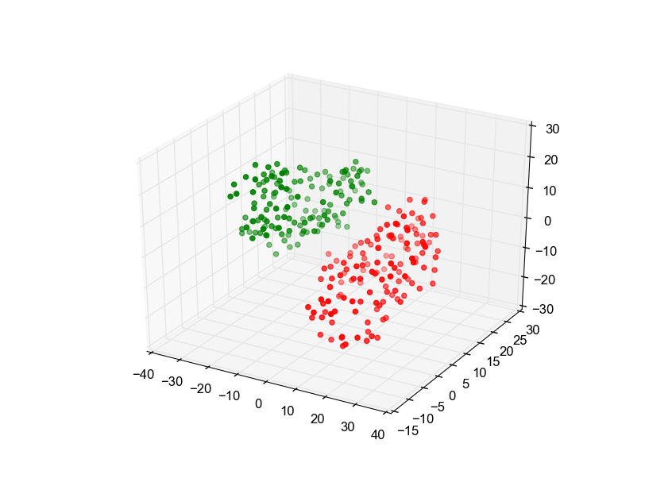
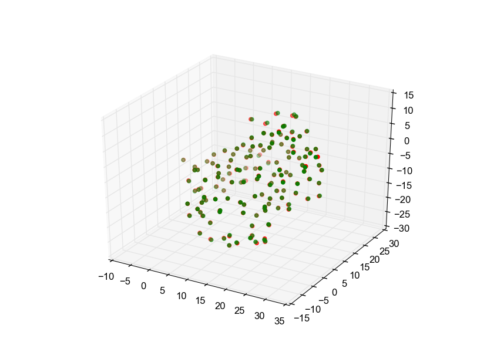
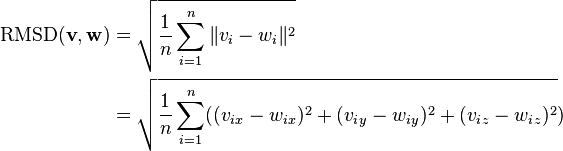
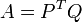
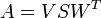
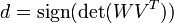
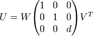

# Kabsch Algorithm
## Introduction

The Kabsch algorithm, named after Wolfgang Kabsch, computes the optimal rotation matrix for two sets of points so that the [RMSD](https://en.wikipedia.org/wiki/Root-mean-square_deviation_of_atomic_positions) (Root mean squared deviation) is minimal. In Bioinformatics this applies to superimposing the C<sub>&alpha</sub> atomic coordinates of two protein structures. 

To illustrate this the following excerpt of the [PDB](https://www.wwpdb.org/documentation/file-format) file of [human deoxyhaemoglobin](http://www.rcsb.org/pdb/explore/explore.do?structureId=2HHB) shows part of one of the alpha chains of the structure. The C<sub>&alpha</sub> atomic coordinates shown can be used to construct a reference matrix which together with another matrix of coordinates (constructed the same way) could serve as the input of the algorithm.

<pre>
<code>
ATOM     17  <b>CA</b>  SER A   3      <b>12.286  19.774   7.034</b>  1.00 27.60           C  
ATOM     18  C   SER A   3      13.529  20.322   6.334  1.00 30.36           C  
ATOM     19  O   SER A   3      13.995  19.754   5.344  1.00 27.40           O  
ATOM     20  CB  SER A   3      12.719  19.060   8.326  1.00 23.83           C  
ATOM     21  OG  SER A   3      13.844  18.245   8.107  1.00 29.07           O  
ATOM     22  N   PRO A   4      14.075  21.454   6.786  1.00 37.36           N  
ATOM     23  <b>CA</b>  PRO A   4      <b>15.285  22.042   6.167</b>  1.00 39.58           C  
ATOM     24  C   PRO A   4      16.466  21.103   6.290  1.00 21.30           C  
ATOM     25  O   PRO A   4      17.288  21.019   5.368  1.00 32.82           O  
ATOM     26  CB  PRO A   4      15.637  23.315   6.942  1.00 45.84           C  
ATOM     27  CG  PRO A   4      14.398  23.603   7.765  1.00 43.31           C  
ATOM     28  CD  PRO A   4      13.513  22.346   7.796  1.00 38.50           C  
ATOM     29  N   ALA A   5      16.484  20.391   7.438  1.00 22.62           N  
ATOM     30  <b>CA</b>  ALA A   5      <b>17.533  19.415   7.651</b>  1.00 26.71           C 
</code>
</pre>

Plotting the initial coordinates of both alpha chains (shown in red and green) already hints at a non-minimal RMSD  (39.46851976701876 Å).



After running the algorithm the alpha chains are superimposed and the RMSD is minimized (0.2300387105661853 Å).



## Usage / Example

```julia
using BiomolecularStructures.Kabsch
# Define two matrices P, Q:
P = [1.0 2.0 3.0; 4.0 5.0 6.0; 7.0 8.0 9.0]
Q = [9.0 8.0 7.0; 6.0 5.0 4.0; 3.0 2.0 1.0]
```

RMSD before superimposing:

```julia
julia> rmsd(P, Q)
```
8.94427190999916

After running the Kabsch algorithm:
```
julia> kabsch_rmsd(P, Q)
``` 
4.8989794855663575

## Exported functions

### `rmsd(A, B)`

Calculates the root mean square deviation of two matrices A and B in using the following formula:



### `calc_centroid(m::Array{Float64,2})`

Returns the centroid of a matrix m as a [x y z] vector (An ```Array{Float54,2}```).

### `translate_points(P::Array{Float64,2}, Q::Array{Float64,2})`

Translates two matrices P, Q so that their centroids are equal to the origin of the coordinate system.

### `kabsch(reference::Array{Float64,2},coords::Array{Float64,2})`

Calculates the optimal rotation matrix of two matrices P, Q.
Using `translate_points` it shifts the matrices' centroids to the origin of the coordinate system, then computes the covariance matrix A:



Next is the singular value decomposition of A:



It's possible that the rotation matrix needs correction:



The optimal rotation matrix U is calculated:



The last two steps are translating U so that the superimposed matrix will "fit" to the reference matrix and then performing the rotation and shifting it to the origin of the coordinate system.

The function returns the superimposed matrix.

### `kabsch_rmsd(P::Array{Float64,2}, Q::Array{Float64,2})`
Directly returns the RMSD after rotation for convenience.

## Background

The Kabsch algorithm solves a constrained orthogonal Procrustes problem. A Procrustes problem is to compare two (or more) shapes. To this, they must be optimally superimposed by translating, rotating and scaling them. 

The constraint applied is that only rotations of the shapes (or matrices in this case) are allowed. Additionally, reflections are not allowed.

In Greek mythology [Procrustes](http://en.wikipedia.org/wiki/Procrustes), ("the stretcher") is a son of Poseidon  who invited travelers to his home and then stretched (or amputated limbs in later versions) to fit his guests to an iron bed using his smith's hammer.

## References

[Kabsch, W. (1976). A solution for the best rotation to relate two sets of vectors. Acta. Crystal, 32A:922-923.](http://scripts.iucr.org/cgi-bin/paper?a12999)

[Kabsch, W. (1978). A discussion of the solution for the best rotation to related two sets of vectors.Acta. Crystal, 34A:827-828.](http://scripts.iucr.org/cgi-bin/paper?S0567739478001680)

[Kavraki, L. Molecular Distance Measures. OpenStax CNX. 11. Juni 2007](http://cnx.org/contents/1d5f91b1-dc0b-44ff-8b4d-8809313588f2@23@23)